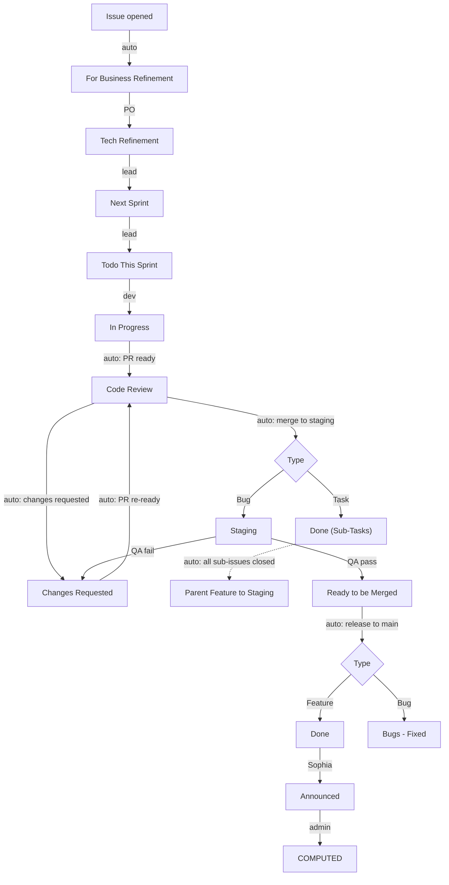

# EPMS Portals board guide

How tickets move on [the board](https://github.com/orgs/E-Konsulta-Medical-Clinic/projects/1), who moves them, and what the robot does for you. If you only read one thing, read the two tables in [Who moves what](#who-moves-what).

Companion to [CONTRIBUTING.md](CONTRIBUTING.md), which covers how to write tickets and PRs. This page covers what happens to them afterwards.

## The four phases

| Phase | Columns | Owned by |
|---|---|---|
| 1 · Planning | Backlog (deprecated), For Business Refinement, Tech Refinement, Next Sprint, Todo (This Sprint) | PO + tech leads |
| 2 · Active Dev | In Progress, Code Review, Changes Requested | Developers + reviewers |
| 3 · QA & Release | Staging, Ready to be Merged, Done | QA + releasers |
| 4 · Admin | Done (Sub-Tasks), Announced, COMPUTED, Bugs - Fixed, LOCKED | Leadership + admin |

## Column definitions

| Column | Meaning | Enters by |
|---|---|---|
| Backlog | **Deprecated.** Do not add new work here. Raw ideas only, pending removal. | Nothing new. Ever. |
| For Business Refinement | PO defines business requirements, acceptance criteria, goals. | **Auto** on new Feature/Bug issue |
| Tech Refinement | Tech leads review, add architecture notes, create Task sub-issues, or send back to PO. | Manual (PO) |
| Next Sprint | Fully refined, approved, queued for the next sprint. | Manual (lead) |
| Todo (This Sprint) | Ready to be picked up by a developer this sprint. | Manual (lead, at sprint start) |
| In Progress | A developer is actively writing code. | Manual (dev picks it up) |
| Code Review | PR open, awaiting tech lead approval. | **Auto** when PR is ready for review |
| Changes Requested | PR failed review or QA found issues. Needs rework. | **Auto** on review "request changes"; manual by QA |
| Staging | Deployed to staging. QA tests **Features and Bugs** here. Never Tasks. | **Auto** on merge to `staging` |
| Ready to be Merged | Passed all QA checks; awaiting production release. | Manual (QA, after staging sign-off) |
| Done | The complete parent functionality is live in production. | **Auto** on release to `main` |
| Done (Sub-Tasks) | Developer-only Task sub-issues merged to staging. QA does not test these. | **Auto** when a Task PR merges to `staging` |
| Announced | Sophia has formally communicated the functionality to users. | Manual (Sophia) |
| COMPUTED | Processed by admin for developer, QA, and designer incentive payouts. Terminal. | Manual (admin) |
| Bugs - Fixed | Bug fixed in production and recorded. **Excluded from incentive payouts** — that is why it is separate from COMPUTED. | **Auto** on release to `main` |
| LOCKED | Cannot be reproduced or permanently blocked. Add a comment saying why. | Manual (anyone, with a reason) |

## Who moves what

### The robot moves these (do not drag them yourself)

The `Board Automation` workflow in each product repo calls the shared routing logic in [`epms-tmpl-devops/.github/workflows/project-board.yml`](https://github.com/E-Konsulta-Medical-Clinic/epms-tmpl-devops/blob/main/.github/workflows/project-board.yml).

| When | What happens |
|---|---|
| Issue opened (or type set) | Feature/Bug → **For Business Refinement**. Task → its parent's column, else **Tech Refinement**. Added to the board automatically. |
| PR marked ready for review | Linked tickets → **Code Review** |
| PR converted to draft | Linked tickets → **In Progress** |
| Review requests changes | Linked tickets → **Changes Requested** |
| PR merged to `staging` | Task → **Done (Sub-Tasks)**. Bug → **Staging**. |
| Last open sub-issue of a Feature closes | Parent Feature → **Staging** (ready for QA) |
| `staging` merged to `main` (release) | Everything from that repo in Ready to be Merged: Feature → **Done**, Bug → **Bugs - Fixed**, stray Task → **Done (Sub-Tasks)** |

The robot knows the difference between a Task, a Bug, and a Feature from the **issue Type**. Set it. For pre-type tickets it falls back to the `[TASK]` / `[BUG]` / `[FEAT]` title prefix.

### Humans move these

| Move | Who |
|---|---|
| For Business Refinement → Tech Refinement | PO, when AC is written |
| Tech Refinement → Next Sprint | Tech lead, when refined and approved |
| Next Sprint → Todo (This Sprint) | Lead, at sprint planning |
| Todo → In Progress | The developer picking it up |
| Staging → Ready to be Merged | QA, after the parent AC passes on staging |
| Staging → Changes Requested | QA, when it fails (comment what broke) |
| Done → Announced | Sophia |
| Announced → COMPUTED | Admin, after payout processing |
| anywhere → LOCKED | Lead, with a comment explaining why |

### The PR gate: required ticket fields

Every non-draft PR runs a **Validate ticket fields** check against the ticket it closes. It fails, telling you exactly what is missing, when the ticket lacks any of:

| Required | Where it lives |
|---|---|
| Issue **Type** (Task / Bug / Feature) | On the issue itself |
| At least one **assignee** | On the issue itself |
| **Requestor** | Board field |
| **Sprint** | Board field |

Fix the ticket, then re-run the failed check (repo → Actions → the failed run → "Re-run failed jobs"). Release PRs to `main` that close no ticket are skipped on purpose. There is no branch protection on the current plan, so a red check does not physically block a merge — treat it as if it did.

## Ticket lifecycles

- **Features** (parents): must pass through Staging for QA, then Ready to be Merged, and land in Done when live. A human closes the Feature issue after QA ticks the parent AC — merging sub-tasks never closes it.
- **Tasks** (dev sub-issues): go straight to Done (Sub-Tasks) on staging merge. QA does not interact with them.
- **Bugs**: verified by QA on Staging, land in Bugs - Fixed once released. Kept out of COMPUTED because bug fixes do not qualify for incentive payouts.

## Tabs (views)

| Tab | For | Shows |
|---|---|---|
| 1 · Refinement | PO + tech leads | For Business Refinement, Tech Refinement, Next Sprint |
| 2 · Active Sprint | Developers | Todo (This Sprint), In Progress, Code Review, Changes Requested |
| 3 · QA & Release | QA + releasers | Staging, Ready to be Merged, Done |
| 4 · Admin & Payouts | Leadership + admin | Done, Done (Sub-Tasks), Announced, COMPUTED, Bugs - Fixed, LOCKED |

Plus the pre-existing tabs: Current Sprint (`sprint:@current`), My items (`assignee:@me`), Roadmap, Team capacity.

## Fields

| Field | Set by | When |
|---|---|---|
| Requestor | PO | At creation — who asked for this |
| Developer | Dev/lead | When picked up — who gets the incentive payout |
| Tester | QA | When it reaches Staging — who signs off |
| Priority (P0–P2) | PO + lead | During refinement |
| Size (XS–XL) | Devs | During tech refinement |
| Sprint | Lead | At sprint planning |

Assignees still work as usual; the Developer/Tester fields exist so payout reports do not depend on guessing from assignee history.

## Rules that keep the board honest

1. **Do not drag robot-owned columns.** If a ticket is in the wrong automated column, the fix is in the PR/issue linkage (`Closes #`), not dragging.
2. **Every PR closes exactly one Task or Bug** (`Closes #id`). Parent Features are referenced with `Part of #id`. See [CONTRIBUTING.md](CONTRIBUTING.md).
3. **Set the issue Type.** The PR gate fails without it, and the router treats typeless tickets with no `[TASK]`/`[BUG]`/`[FEAT]` prefix as Features.
4. **Backlog is closed for business.** Raw ideas do not go on the engineering board.
5. **LOCKED needs a comment.** A ticket parked without a reason is a mystery, not a record.

## When the robot misbehaves

- Ticket did not move? Check the repo's **Actions → Board Automation** run for that event. The run log lists every move it made or skipped.
- All runs failing with `node: null` or `Not Found`: the `EPMS_BOARD_TOKEN` secret is missing, expired, or lost repo read permissions. It is a fine-grained PAT needing **org Projects: Read/Write** plus **Issues: Read** and **Pull requests: Read** on all repos, stored as a repo secret in each product repo.
- Renamed a status column? Update the names in `epms-tmpl-devops/.github/workflows/project-board.yml` (the `S` map at the top) in the same breath, or routing will fail loudly.
- The two remaining built-in project workflows are intentional: **Auto-archive items** (hides stale closed items from views; archived items stay searchable) and nothing else. The other five native automations were deleted on purpose — do not re-enable them, they cannot tell a Task from a Bug.
