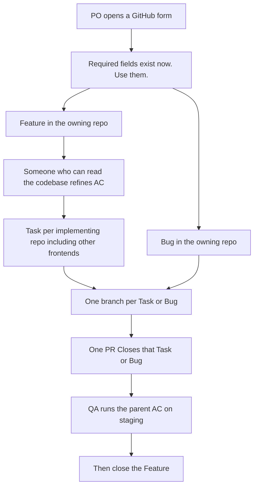
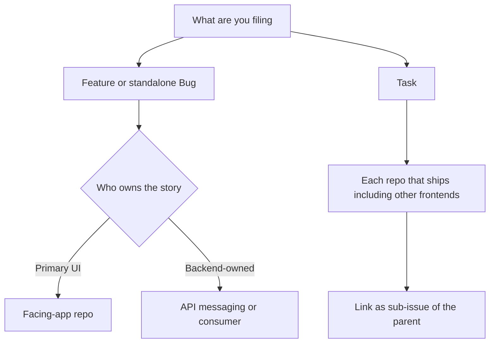
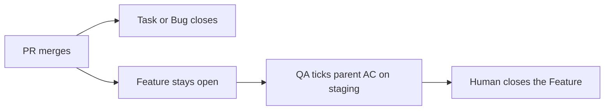

# How we ship without rewriting the ticket at 11pm

You have two minutes. If you came here to skip the forms, congratulations: the forms are now the easy part. This page is the part people ignore, which is why Features keep dying from `Closes #parent`.

Screenshot the TL;DR. Then pretend you read the rest.

## TL;DR

- **Feature** = the promise. Lives in the **owning repo** (usually the primary app, sometimes the backend). QA ticks this one on staging.
- **Task** = one repo doing one job. This is what your PR closes.
- **Bug** = something is wrong. Same closing rules as a Task. If it belongs to a Feature, it is a sub-issue, not a rewrite of the Feature.
- **One Task, one branch, one PR.** If your PR also "quickly" touches two other repos, that is three Tasks and you know it.
- Write `Closes #<task-or-bug>`. Write `Part of #<feature>`. Mix those up and you gaslight QA.
- **The board moves itself.** A robot routes tickets on [the EPMS Portals board](https://github.com/orgs/E-Konsulta-Medical-Clinic/projects/1) from your PR events. Who moves what, and which columns are yours to drag: [BOARD_GUIDE.md](BOARD_GUIDE.md).



## The three types, translated to human

| Type | What it is | What it is not |
|---|---|---|
| **Feature** | The movie. User story, why, QA checklist, design states. | A vibes-based "make it nicer." |
| **Task** | One scene, one repo. 1–3 sentences + the AC this repo covers. | A design document. A dumping ground. A second Feature. |
| **Bug** | Something is on fire, or at least smoking. Repro steps. Expected vs actual. | A Feature with worse grammar. |

If your "Feature" is "fix the button," you picked the wrong form. If your "Bug" is "we should add a report," also wrong. The colored ring is not decoration.

## Where the ticket lives

The **Feature** (or standalone Bug) lives in the **owning repo**. Default: the primary app a human opens. It can also live in a backend when that repo owns the work (`epms-api`, `epms-messaging`, a consumer).

| If the story is mainly… | Parent lives in |
|---|---|
| Control Center / PCO / Chat Manager UI | `epms-control-center-ui` |
| Patient app | `epms-patient-ui` |
| Doctor app | `epms-doctor-ui` |
| Partner app | `epms-partner-ui` |
| Legacy / public web | `epms-web-ui` |
| API-owned (or no UI yet) | `epms-api` |
| Messaging-owned | `epms-messaging` |
| A worker / consumer | that consumer repo |

**Tasks** are sub-issues in **every** repo that ships code for that Feature. That includes **other frontends**, not only API and workers. A Center Feature can have Tasks in Patient, Doctor, API, and messaging. An API parent can have frontend Tasks. Cross-repo is the point.

One Task per repo. One PR per Task. Do not file the Patient work as a comment on the Center parent.



## Closing rules, the part people skip

The parent Feature is the movie. Your Task is one scene. Do not write `Closes` on the whole franchise.



| Issue | Who closes it | Magic words |
|---|---|---|
| Task or Bug | GitHub, on merge | `Closes #<id>` in the PR |
| Feature | A human, after QA | `Part of #<feature>` in every PR. Never `Closes`. |

Do **not** turn on "auto-close parent when sub-issues complete." That closes the movie when the last scene is edited, not when QA watched it.

## Branch names and PR titles

Number is the **Task or Bug this PR closes**. Never the parent Feature number. We already lived through `fix/600-...` closing the wrong thing.

```
feat/451-lost-reason
fix/600-sort-by-specialization
chore/812-drop-dead-endpoint
```

PR title, same energy:

```
feat: #451 [API] Persist lostReason on conversation close
fix: #600 [Center] Sort doctor directory by specialization
```

`feat` for Feature work. `fix` for Bugs. `chore` for debt and devops. `fix-stuff-final-FINAL-2` is not a convention, it is a cry for help.

## PRs for people who will not read your essay

The reviewer has **20 seconds**. If they need a coffee to parse it, rewrite it.

- `Closes #<task-or-bug>`
- `Part of #<feature>` (omit on a standalone Bug)
- **What changed:** 3–5 bullets about the diff, not your feelings
- **How to QA:** paste the Done when / AC this PR actually covers
- **Risk:** PII checkbox + `none | migration | permission | flag`

Staging sign-off of the whole Feature does not belong on a Task PR. That is the parent's job. Your job is "this scene works."

## PO corner

Blank acceptance criteria is not mysterious and agile. It is a blank check we will not cash.

- If it is not in the AC checklist, **it will not get built.**
- Each `Then` is something QA can see or click. "Works well" is not a `Then`.
- Figma, or the four states (Ideal / Empty / Loading / Error). There is no third option called "the dev will know."
- "Make it nice" is a vibe. It is not a ticket.

Devs and AI will refine messy Features against the codebase. That is not a license to file "as a user I want stuff."

## Engineers using Cursor

There is a skill called `ek-github-workflow` in each product repo (`.cursor/skills/ek-github-workflow/`). Use it to refine AC, split Tasks, and write PR bodies. It will not write you a sarcastic ticket. The jokes stay on this page. The tickets stay boring on purpose.
